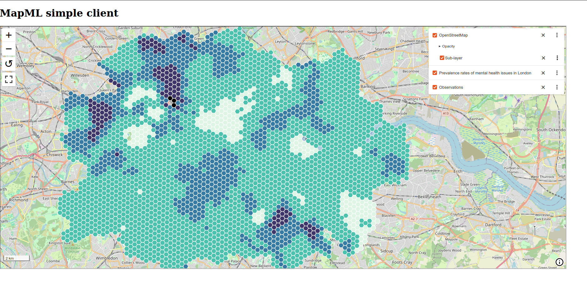

<!--
theme: base
paginate: true
footer: 'Ricardo Garcia Silva <ricardo.garcia.silva@geobeyond.it> - July 2024'
-->

# MapML server integration

### Prototyping serving geospatial resources with OGC APIs and MapML


---

<!--
footer: ''
-->

# Server implementation

- Goal: Implement _MapML_ support without modifying pygeoapi core, ideally via
  plugins
- Ended up implementing a two-component design:

  - a pygeoapi plugin that defines a provider for tiles
  - a small middleware for pygeoapi's flask application

- Successfully prototyped _MapML_ support for

  - features of type _Point_
  - Image-based tiles


---

# pygeoapi MapML tile provider plugin

Implemented a pygeoapi provider that is able to return tile metadata as a 
`MapML` document

- Recognizes the `text/mapml` media-type
- Returns a _MapML_ document

---

# pygeoapi MapML tile provider plugin

```shell
http localhost:5000/collections/grid_mental/tiles/WebMercatorQuad "Accept:text/mapml"
```

```shell
HTTP/1.1 200 OK
Content-Type: text/mapml

<mapml- xmlns="http://www.w3.org/1999/xhtml">
    <map-head>
        <map-title>Prevalence rates of mental health issues in London</map-title>
        <map-meta http-equiv="Content-Type" content="text/mapml;projection=OSMTILE"></map-meta>
        <map-meta charset="utf-8"></map-meta>
        <map-meta name="extent" content="top-left-easting=-29028.26648413821, top-left-northing=6694074.574114459, bottom-right-easting=14106.427797324195, bottom-right-northing=6724542.93687513"></map-meta>
        <map-link rel="license" href="" title=""></map-link>
    </map-head>
    <map-body>
        <map-extent units="OSMTILE" checked="checked">
            <map-input name="tileMatrix" type="zoom" value="0" min="0" max="18"></map-input>
            <map-input name="tileCol" type="location" units="tilematrix" axis="column"></map-input>
            <map-input name="tileRow" type="location" units="tilematrix" axis="row"></map-input>
            <map-link rel="tile" tref="http://localhost:5000/collections/grid_mental/tiles/WebMercatorQuad/{tileMatrix}/{tileRow}/{tileCol}?f=png"></map-link>
        </map-extent>
    </map-body>
</mapml->
```

---


# pygeoapi wrapper code

- Adds support for the `text/mapml` media-type for some endpoints
- Responds to OGC API Features requests with _MapML_, if requested
- Performs post-processing of features in order to convert them from _GeoJSON_
  into _MapML_


---

# pygeoapi wrapper code

```shell
http localhost:5000/collections/obs/items "Accept:text/mapml" limit==1
```

```shell
HTTP/1.1 200 OK
Content-Type: text/mapml

<mapml- xmlns="http://www.w3.org/1999/xhtml">
    <map-head>
        <map-title>Observations</map-title>
        <map-meta name="projection" content="OSMTILE"></map-meta>
        <map-meta http-equiv="Content-Type" content="text/mapml;projection=OSMTILE"></map-meta>
        <map-meta charset="utf-8"></map-meta>
        <map-meta name="cs" content="gcrs"></map-meta>
        <map-meta name="extent" content="top-left-longitude=-122, top-left-latitude=49, bottom-right-longitude=-75, bottom-right-latitude=43"></map-meta>
        <map-link rel="license" href="" title=""></map-link>
    </map-head>
    <map-body><map-feature>
            <map-properties>
                <table>
                    <tbody><tr>
                            <td>stn_id</td>
                            <td>35</td>
                        </tr><tr>
                            <td>datetime</td>
                            <td>2001-10-30T14:24:55Z</td>
                        </tr><tr>
                            <td>value</td>
                            <td>89.9</td>
                        </tr></tbody>
                </table>
            </map-properties>
            <map-geometry><map-point><map-coordinates>-75.00000000 45.00000000</map-coordinates></map-point></map-geometry>
        </map-feature></map-body>
</mapml->
```

---

# Client implementation

- Wrote a simple HTML page
- Uses the `@maps4html/web-map-custom-element` js library to emulate browser 
  support for MapML
- Has a `<mapml-viewer>` element
- Defines three different _MapML_ `<layer->` elements:

  - A tile-based layer defined inline - fetches data from an OSM server
  - Two remote layers that request data from our server and demonstrated the
  prototyped _MapML_ support for:
      - Image tiles layer 
      - Features


---

# Results



---

# Conclusion/discussion

- 🟢 _MapML_ is a viable output type for serving geospatial data and integration 
  with existing OGC API server implementations seems doable
- 🟠 However, _MapML_ remote layer definitions seem to be competing with the 
  corresponding OGC APIs and don't seem to bring additional value, from
  the perspective of the backend server
- 🟠 _MapML_ considerably simplifies the development of client applications, but
  at the moment this is at the expense of complicating server implementations
  by employing an additional media-type
- 🔵 Personally, I'd find it much more valuable if _MapML_ relied on the existing 
  OGC APIs' JSON-based media-types and would leverage them transparently